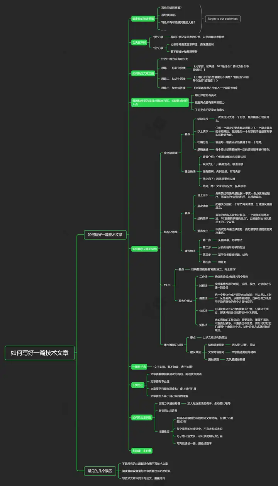

# 如何写好一篇技术文章

如何

<figure><figcaption>
如何写好一篇技术文章
</figcaption></figure>

撰写技术文章的主要目的在于让读者更为简单的了解和运用一个复杂的产品

必须要确定你的目标读者群体

好的技术文章，无非是两样东西：看得懂、能学到东西。

一、做好选题

二、确定标题

三、列好大纲

四、制作图片素材

一图胜千言，

四、删减冗余的内容

五、撰写引言|前言

精炼覆盖全篇所讲的内容

六、优化排版

